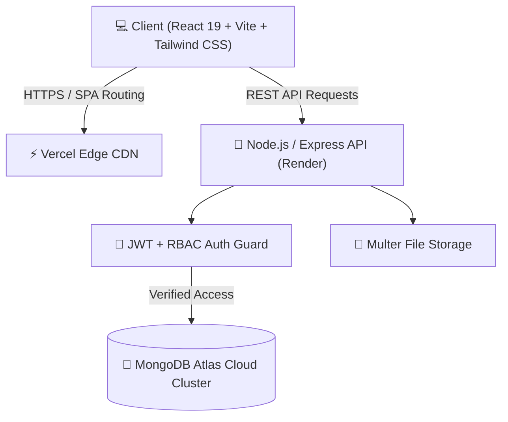

<div align="center">

# 🎓 Campus Redressal
### *College Complaint & Grievance Redressal Management System*

A full-stack, enterprise-grade MERN application designed to streamline, automate, and resolve college campus grievances with transparency, role-based access control, and complete data privacy.

[](https://campus-redressal-92c9rjywk-code-x-cb6b.vercel.app)
[](https://campusredressal-1.onrender.com)
[](https://www.mongodb.com/cloud/atlas)
[](https://react.dev/)
[](https://nodejs.org/)
[](https://tailwindcss.com/)

[**🔗 Live Web App Demo**](https://campus-redressal-92c9rjywk-code-x-cb6b.vercel.app) • [**📚 API Documentation**](#-api-endpoints) • [**🚀 Deployment Guide**](#-deployment-guide)

</div>

---

## 🌟 Key Highlights & Features

### 👤 1. Student Portal
* **Dynamic Registration Verification**: Sign up with your college domain (`@college.edu`) or verify with a Student ID number for `@gmail.com` addresses.
* **Anonymous Filing Option**: Submit sensitive grievances with **Identity Shielding** — your name and student ID are stripped and protected from public and staff views.
* **AI/Heuristic Duplicate Detection**: Live detection of similar ongoing complaints in the same category as you type to prevent redundancy.
* **Community Board & +1 Upvoting**: Browse public complaints filtered by category (Hostel, Academic, Infrastructure, Canteen, IT, Harassment) and upvote existing issues.
* **Real-time Resolution Timeline**: Inspect visual chronological status transitions and official remarks from department staff.
* **Feedback Rating & Reopening**: Rate resolution satisfaction (1–5 stars) or reopen unresolved complaints with a stated reason.

### 🛡️ 2. Department Staff Portal
* **Department-Scoped Work Queue**: Staff members only see complaints assigned to their designated department (e.g., *Hostel Warden*, *Anti-Ragging Committee*, *Maintenance Desk*).
* **403 Forbidden Security Enforcement**: Strict backend security blocks cross-department snooping or illegal updates.
* **Department Analytics**: Real-time breakdown of open, in-progress, and resolved department cases.
* **Official Status Updates**: Move complaints from `Pending` ➔ `In Progress` ➔ `Resolved` / `Rejected` with official remarks.

### 👑 3. System Administrator Portal
* **Global Campus Analytics**: Campus-wide KPIs for total grievances, resolution averages, department loads, and pending queues.
* **Full Audit Trail**: Chronological immutable log tracking every admin/staff action, status change, timestamp, and user IP/identity.
* **Master Search & Multi-Filter**: Filter grievances by priority, category, status, or search query.
* **Emergency Auto-Priority Routing**: Sensitive categories like *Ragging/Harassment* are automatically assigned **Urgent** priority and highlighted at the top.

---

## 🔐 Demo Credentials

You can test the live deployment using the pre-seeded demo accounts:

| Role | Email | Password | Access / Scope |
| :--- | :--- | :--- | :--- |
| **Student** | `student@college.edu` | `student123` | Student Dashboard & Community Board |
| **Admin** | `admin@college.edu` | `admin123` | Master Analytics, All Depts & Audit Logs |
| **Staff** | `staff@college.edu` | `staff123` | Hostel Warden Department Queue |

> 💡 **Quick Login Easter Egg**: On the login page, **click the Shield Logo once** to toggle the instant demo login panel! When active, the logo glows **White**; when closed, it returns to **Green**.

---

## 🏗️ System Architecture



---

## 🛠️ Technology Stack

| Layer | Technology | Purpose |
| :--- | :--- | :--- |
| **Frontend** | **React 19**, **Vite**, **React Router 7** | High-performance Single Page Application |
| **Styling** | **Tailwind CSS v4**, **Lucide Icons** | Modern glassmorphism UI with dark theme |
| **Backend** | **Node.js**, **Express.js** | RESTful API server with custom middlewares |
| **Database** | **MongoDB Atlas**, **Mongoose** | Cloud NoSQL database with fallback in-memory support |
| **Security** | **JSON Web Tokens (JWT)**, **Bcrypt.js** | Stateless authentication & cryptographic password hashing |
| **File Handling** | **Multer** | Secure multi-part form file and photo attachments |
| **Hosting** | **Vercel** (Frontend) + **Render** (Backend) | 24/7 cloud availability with automated CI/CD |

---

## 📂 Project Structure

```
CampusRedressal/
├── backend/
│   ├── controllers/
│   │   ├── authController.js        # Authentication, JWT, and registration logic
│   │   └── complaintController.js   # Grievance CRUD, upvotes, duplicate check, scoping
│   ├── middleware/
│   │   └── auth.js                  # JWT verification & role-based route guards
│   ├── models/
│   │   ├── User.js                  # User schema (roles: student, staff, admin)
│   │   ├── Complaint.js             # Grievance schema, status history & ratings
│   │   └── AuditLog.js              # Admin activity audit trail
│   ├── scripts/
│   │   └── seed.js                  # Database seed script with default accounts
│   ├── server.js                    # Express application entry & CORS configuration
│   └── package.json
├── frontend/
│   ├── src/
│   │   ├── context/
│   │   │   └── AuthContext.jsx      # Global authentication state provider
│   │   ├── pages/
│   │   │   ├── Login.jsx            # Sign in page with hidden toggle easter egg
│   │   │   ├── Register.jsx         # Dynamic student registration
│   │   │   ├── StudentDashboard.jsx # Student grievance management & community board
│   │   │   ├── StaffDashboard.jsx   # Department-scoped queue & resolution tool
│   │   │   ├── AdminDashboard.jsx   # Master analytics & audit log dashboard
│   │   │   └── ComplaintDetail.jsx  # Detailed grievance view, timeline & discussion
│   │   ├── App.jsx                  # Route definitions and access restrictions
│   │   ├── main.jsx
│   │   └── index.css                # Tailwind CSS v4 design system
│   ├── vercel.json                  # SPA rewrite configuration
│   └── package.json
└── README.md
```

---

## 📡 API Endpoints

### Authentication
* `POST /api/auth/register` — Student account registration (validates email domain/student ID)
* `POST /api/auth/login` — Sign in and receive JWT token
* `GET  /api/auth/me` — Retrieve current authenticated user session profile

### Complaints Management
* `GET    /api/complaints` — Retrieve complaints (auto-scoped for staff, filterable for admin)
* `POST   /api/complaints` — Submit a new grievance (supports attachments & anonymity)
* `GET    /api/complaints/mine` — Retrieve authenticated student's personal filings
* `GET    /api/complaints/:id` — View complaint details and full resolution history
* `PATCH  /api/complaints/:id/status` — Update resolution status (Admin & assigned Staff only)
* `POST   /api/complaints/:id/comments` — Post a message/clarification to the complaint thread
* `POST   /api/complaints/:id/upvote` — Toggle +1 upvote on community grievances
* `POST   /api/complaints/:id/feedback` — Submit 1–5 star rating on resolved complaints
* `POST   /api/complaints/:id/reopen` — Reopen a resolved/rejected complaint
* `GET    /api/complaints/check-duplicate` — Check for potential duplicate grievances
* `GET    /api/complaints/analytics` — Fetch KPI statistics and audit logs

---

## 💻 Local Development Setup

### Prerequisites
* [Node.js](https://nodejs.org/) (v18 or higher)
* [Git](https://git-scm.com/)
* MongoDB Atlas account (or use built-in automatic In-Memory database)

### 1. Clone the Repository
```bash
git clone https://github.com/amruthck177/CampusRedressal.git
cd CampusRedressal
```

### 2. Backend Setup
```bash
cd backend
npm install
```

Create a `.env` file in the `backend/` directory:
```env
PORT=5000
NODE_ENV=development
MONGODB_URI=your_mongodb_atlas_connection_string
JWT_SECRET=your_jwt_secret_key_here
ALLOWED_EMAIL_DOMAIN=college.edu
FRONTEND_URL=http://localhost:5173
```

Start the backend server:
```bash
npm run dev
```

### 3. Frontend Setup
In a new terminal window:
```bash
cd frontend
npm install
npm run dev
```

The application will be running locally at `http://localhost:5173`.

---

## 🚢 Deployment Guide

### Backend on [Render](https://render.com)
1. Create a **New Web Service** pointing to your repository.
2. Set **Root Directory** to `backend`.
3. Set **Build Command** to `npm install` and **Start Command** to `npm start`.
4. Configure the Environment Variables:
   * `NODE_ENV` = `production`
   * `MONGODB_URI` = `your_mongodb_connection_string`
   * `JWT_SECRET` = `your_jwt_secret`
   * `ALLOWED_EMAIL_DOMAIN` = `college.edu`
   * `FRONTEND_URL` = `https://your-app.vercel.app`

### Frontend on [Vercel](https://vercel.com)
1. Import the repository on Vercel.
2. Set **Root Directory** to `frontend`.
3. Framework preset: **Vite**.
4. Configure Environment Variable:
   * `VITE_API_URL` = `https://your-render-service.onrender.com/api`
5. Click **Deploy**.

---

## 🔒 Security Best Practices Implemented
* **Zero Credential Leaks**: `.env` and sensitive configurations are strictly excluded via `.gitignore`.
* **CORS Whitelisting**: Restricted origin headers in production prevent unauthorized cross-origin requests.
* **Identity Shielding**: Strips author credentials on the server before transmitting anonymous complaints.
* **Bcrypt Password Hashing**: Passwords are salted and hashed with bcrypt (salt factor 10).
* **Role-Based Access Control (RBAC)**: Route-level middleware intercepts unauthorized operations with HTTP 403 Forbidden.

---

## 📄 License
This project is open-source and available under the [MIT License](LICENSE).
